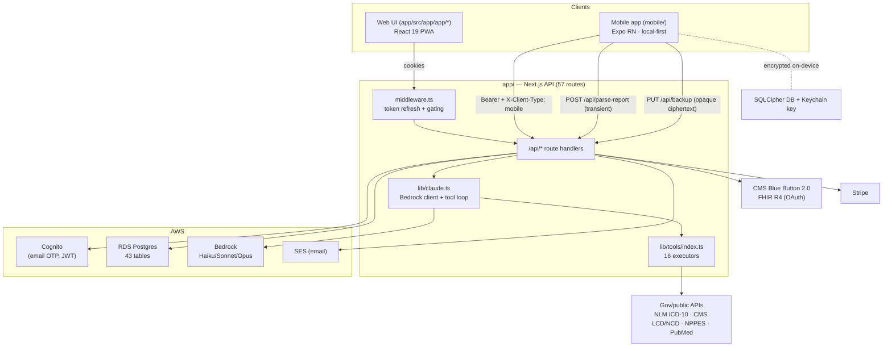

# denali.health — Whole-Repo Current-State Review

> **Scope:** entire repository. **Type:** read-only, evidence-grounded analysis (no code/config/infra/secret was modified or read).
> **Evidence rule:** every capability claim cites `path:line` from **code / tests / config only**. Prose docs (`*.md`, incl. `CLAUDE.md`) were **not** used as evidence — only to phrase an `UNCERTAIN`. Confidence tags: `HIGH` / `MEDIUM` / `LOW`.
> **Produced:** 2026-07-03. **Reviewer:** Claude Code (main thread synthesis over 7 bounded read-only evidence passes; all load-bearing claims re-verified against source by the main thread — see §4.13).

---

## 4.1 Repository tree structure

Derived from `git ls-files` (983 tracked files). Untracked build output is auto-excluded. Depth ≤3 repo-wide, depth 4 inside the two `src/` roots. Pruned dirs shown once.

```
denali/                          # NOT a workspace monorepo — two independent npm projects (no root package.json)
├── app/                         # ⬛ Next.js 16 web app — Medicare claims PWA (434 files). HAS a live prod deploy pipeline.
│   ├── certs/                   #   rds-global-bundle.pem (RDS TLS CA; copied into Docker image)
│   ├── e2e/                     #   Playwright E2E — 46 *.spec.ts files
│   ├── email-templates/         #   archived OTP HTML (not wired to code)
│   ├── public/                  #   static assets + sw.js (PWA service worker)
│   ├── scripts/                 #   idme migration SQL
│   ├── src/
│   │   ├── app/                 #   Next app-router
│   │   │   ├── api/             #     57 backend route handlers (route.ts) — the HTTP surface
│   │   │   ├── app/             #     authed web shell: dashboard, chat, health, claims, diabetes, settings
│   │   │   └── …                #     public pages: blog, faq, hipaa, privacy, terms, onboarding, report
│   │   ├── components/          #   React UI (chat, payment, health, dashboard, landing, layout…)
│   │   ├── config/              #   API_CONFIG (models), PRICING
│   │   ├── hooks/               #   useAuth, useChat, useHealthData, useConsent…
│   │   ├── lib/                 #   CORE: claude.ts, db.ts, auth-server.ts, audit.ts, learning.ts,
│   │   │   ├── fhir/            #        Blue Button: crypto, tokens, context, transforms, eob-clinical
│   │   │   ├── tools/           #        16 local tool executors (index.ts)
│   │   │   ├── skills/ +skills-loader.ts, metrics/, alerts/
│   │   │   └── e2e-test-otp.ts  #        isolated test-auth bypass (fail-closed in prod)
│   │   ├── skills/              #   TS skill content (channel/core/domain)
│   │   ├── middleware.ts        #   every-request token refresh + route gating
│   │   └── types/
│   ├── Dockerfile               #   node:20-alpine (SHA-pinned), 3-stage standalone build
│   ├── next.config.ts · tsconfig.json · vitest.config.ts · playwright.config.ts · package.json
│
├── mobile/                      # ⬛ Expo 56 / RN 0.85 app — Phase-1 "45+" (314 files). Staging-only; no prod release path found.
│   ├── android/ · ios/          #   [native projects — ios/Pods, android/.gradle, build output PRUNED]
│   ├── maestro/                 #   E2E — 10 flows + 1 smoke (crisis_988, cross_user_isolation, signin_onboarding…)
│   ├── src/
│   │   ├── api/ · auth/         #   OTP client, token store (secure-store), session policy, biometric gate, chatStream
│   │   ├── backup/              #   zero-knowledge encrypted cloud backup (@noble AES-256-GCM + HKDF)
│   │   ├── contracts/           #   FROZEN seams: LocalDataDAL, Theme, ApiClient
│   │   ├── db/                  #   SQLCipher open + keystore + migrations(001,002) + dal/(6 tables)
│   │   ├── onboarding/          #   cohort + intake + instruments/(PHQ-9,PHQ-2,GAD-7,AUDIT-C,Epworth,IPSS,MRS,ADAM) + safety(988)
│   │   ├── preventive/          #   USPSTF "Due for" engine — ships EMPTY (uspstf.ts)
│   │   ├── screens/             #   timeline/, chat/, upload/, settings/, markers/ …
│   │   ├── theme/ · components/ · navigation/ · notifications/ · feedback/ · a11y/ · lib/(provenance)
│   ├── app.config.ts            #   Expo config: useSQLCipher:true, apiBaseUrl→staging, 988 dialer manifest fix
│   └── package.json · tsconfig.json · vitest.config.ts · eslint.config.js
│
├── infra/                       # ⬛ IaC (split posture)
│   ├── staging/                 #   Terraform — provisions ONLY a rotation-recovery Lambda (rest is data-sources)
│   │   └── lambda/…             #   python rotation_recovery
│   └── cfn-{scheduler,alerts-scheduler,monitor}.json   #   PROD via CloudFormation (cost scheduler, alert cron, monitor)
├── .github/workflows/           # ⬛ deploy.yml (prod/main), deploy-staging.yml (develop), mobile-ci.yml, mobile-e2e.yml (PARKED)
├── sql/001-schema.sql           # ⬛ web RDS schema snapshot — 43 tables (staging seed / E2E bootstrap)
├── scripts/                     #   migrate-*.sql (20+ prod migrations) + seeds + one-shot cleanup .sh
├── skills/                      #   SKILL.md prose (design docs; NOT a runtime artifact)          [prose — not evidence]
├── denali-monitor/index.py      #   standalone monitor source (Cost-Explorer variant)
├── memory/aws-infra.md          #   [prose — not evidence]
├── docs/                        #   122 prose docs (design/history/reference/runbooks)            [prose — not evidence]
├── .claude/                     #   agents/ + hooks/(guard-contracts, guard-persistence) + settings
├── .mcp.json                    #   committed MCP connectors (icd10 / pubmed / npi)
├── node_modules/ [pruned] · app/node_modules/ [pruned] · mobile/node_modules/ [pruned]
└── (root *.md: README, CLAUDE.md, cms_ready.md, awsmigrationplan.md, …)                            [prose — not evidence]
```

---

## 4.2 Executive summary

**What this repository is.** A single git repo holding **two independent TypeScript products** (no root `package.json`; two separate `package-lock.json` → npm, not a workspace):

1. **`app/` — the web app** (`denali.health`): a Next.js 16 / React 19 Medicare-claims-intelligence PWA. Claude (via **AWS Bedrock**) drives a chat that calls 16 government/local "tools," generates appeal letters, ingests Blue Button 2.0 FHIR claims, and takes Stripe payments. Backed by **RDS Postgres** (43 tables) and **AWS Cognito** email-OTP auth. This app has an **active production deploy pipeline** (`deploy.yml` → ECS cluster `denali` on push to `main`).

2. **`mobile/` — the Expo/React-Native app** ("Phase 1, 45+"): a **local-first** longitudinal health check-in app. Health data lives **on-device in an encrypted SQLCipher DB**; validated mental-health/symptom instruments (PHQ-9, GAD-7, AUDIT-C, Epworth, IPSS, MRS, ADAM) are scored locally; a deterministic **988 crisis pathway** fires before any model call; lab uploads are parsed transiently server-side and committed locally. It talks only to the web app's backend over HTTPS and **defaults to `staging.denali.health`**.

**How they relate.** The mobile app is a **client of the web app's `/api/*` routes** (auth, chat, `parse-report`, zero-knowledge `backup`), distinguished by an `X-Client-Type: mobile` header that forces **no-server-persistence** branches. There is no shared code package — the mobile app re-implements its own theme/DAL/contracts.

**The 3–5 things a new engineer/stakeholder must know:**

- **Two maturity levels.** The web backend is production-grade and prod-deployed (57 routes, 92 unit-test files with per-file coverage gates up to 100%, 46 Playwright specs, live ECS/RDS). The mobile app is **staging-only**: feature-complete in code with 78 test files and 10 Maestro flows, but its **E2E CI gate is deliberately parked** (`mobile-e2e.yml:51` is `workflow_dispatch`-only) and its API base URL defaults to staging (`app.config.ts:76`).
- **"Deterministic core, RAG explanation" is only half-built.** The determinism story holds for **instruments** (local scoring + versioned interpretation table) and the **988 safety pathway**. But the **screening-eligibility engine ships empty** (`uspstf.ts:69` `PREVENTIVE_RECOMMENDATIONS = []`) and there is **no retrieval/RAG or citation grounding anywhere** — both apps are **direct-LLM + tool-calling**, not RAG (see §4.8).
- **PHI is well-isolated but by convention, not by the database.** Web: no RLS (`db.ts:5`); isolation is application-layer `WHERE user_id = $1` keyed to a verified Cognito `sub` (§4.6). Mobile: PHI never leaves the device readable; SQLCipher-at-rest and on-device key generation are genuinely implemented (§4.6).
- **Known go-live blockers are visible in code**: the parked E2E gate, the empty preventive engine, **`organ_inventory` gating is specified but unimplemented** (`uspstf.ts` gates on sex+age only), copyrighted instruments (Epworth/ESS, MRS) ship with **no licence handling**, and every clinical interpretation string is still `provisional` (`tableV1` v`1.3.1-provisional`).

---

## 4.3 Project & stack map

| Project | Language / framework | Pkg mgr | Build / test / run (as found) | Relationship |
|---|---|---|---|---|
| **`app/` (web)** | TypeScript, **Next.js 16.1.6**, React 19.2.3, Node 20 | npm (`app/package-lock.json`) | `next build` / `vitest run` + `playwright test` / `next start` (`app/package.json:6-13`); container `node server.js` (`Dockerfile:65`) | Backend for BOTH web UI and the mobile app; owns RDS + Cognito + Stripe + Bedrock + Blue Button |
| **`mobile/` (RN)** | TypeScript, **Expo ~56 / RN 0.85.3**, React 19.2.3 | npm (`mobile/package-lock.json`) | `expo run:ios/android` / `vitest run` / `tsc --noEmit` (`mobile/package.json:6-14`); E2E via Maestro (`mobile/maestro/`) | Client of `app/`'s `/api/*`; local-first, no own server |
| **`infra/staging/`** | Terraform (`>=` per `versions.tf`), S3 backend | terraform | `terraform apply` (not run) | Manages **only** a staging rotation-recovery Lambda; all other AWS objects are `data` sources |
| **`infra/*.json`** | CloudFormation JSON | aws cli (deploy-*.sh) | — | **Prod** cost scheduler, alert cron, infra monitor |
| **`denali-monitor/`** | Python 3.12 | — | AWS Lambda | Standalone monitor source (a second, CFN-inlined copy is the deployed one) |

**Inter-project / data-flow topology:**



Model IDs / client selection: `lib/claude.ts:78-86` (Anthropic direct if `ANTHROPIC_API_KEY` present, else `AnthropicBedrock` IAM) — in prod ECS there is no key, so **Bedrock always**. `HIGH`.

---

## 4.4 Current capabilities (the headline: what it can actually do today)

Tags: `WORKING` (code path complete + tested/deploy-gated) · `PARTIAL` (works with a stated gap) · `STUBBED` (scaffold only, no runtime effect).

### Web app (`app/`) — has a live prod pipeline

| Capability | Status | Evidence (`path:line`) | Conf. |
|---|---|---|---|
| Email-OTP sign-in via Cognito; JWT-verified sessions | **WORKING** | `auth-server.ts:70` `getVerifier().verify(token)` → `payload.sub`; `api/auth/{send-otp,verify-otp}/route.ts`; 100% coverage gate on `auth-server`/`refresh`/`middleware` (`vitest.config.ts:63-77`) | HIGH |
| Silent token refresh + 7-day session cap on every request | **WORKING** | `middleware.ts:43-110` (refresh call, 503→stay, session-age redirect) | HIGH |
| AI chat: Bedrock Claude + tool-use loop + skill-assembled prompt | **WORKING** | `claude.ts:76-89`; `api/chat/route.ts` (rate-limit→skills→model→persist); tools at `tools/index.ts` | MEDIUM (live-prod behavior not exercised in this pass) |
| Plan-based model routing (trial→Haiku, paid→Sonnet, appeal→Opus) | **WORKING** | `api/chat/route.ts:605-611` (`isAppeal > isTrial > paid`) | HIGH |
| 16 tool executors (ICD-10, LCD/NCD, NPI, CPT, SAD, PubMed, denial codes, appeal-letter) | **WORKING** | `tools/index.ts` (external fetches at :489, :518, :632, :944; RDS lookups at :1751, :1976) — no PHI sent to external APIs | HIGH |
| Blue Button 2.0 FHIR OAuth + encrypted token storage + claims sync | **WORKING** | `api/fhir/{authorize,callback,data}/route.ts`; tokens AES-256-GCM (`fhir/crypto.ts:10-19`); PII discarded (`fhir/transforms.ts:148-168`) | MEDIUM (CMS side not exercisable here) |
| Stripe checkout + webhooks (HMAC-verified) + billing portal | **WORKING** | `api/checkout/route.ts` (503 if no key, never `{url:null}`); `api/webhooks/stripe/route.ts:31` `constructEvent`; 95% coverage gate on `stripe-fulfillment` | MEDIUM |
| Appeal-letter generation (Opus), Medicare-gated + credit-gated | **WORKING** | `api/appeals/route.ts:34` 403 gate; `tools/index.ts:1074+` template generator | MEDIUM |
| Diabetes log / insights (Bedrock) / longitudinal snapshots | **WORKING** | `api/diabetes/{log,insights,snapshots}/route.ts`; `insights` gated on `health_data_ai` consent (`:58`) | MEDIUM |
| 3-toggle consent enforced server-side (not just UI) | **WORKING** | `api/chat/route.ts:930-944` (403 `HEALTH_DATA_AI_DISABLED`); `fhir/context.ts:19` `!== true` gate | HIGH |
| Append-only audit log (DB-enforced) | **WORKING** | `scripts/migrate-audit-logs-baseline.sql:37-38` `REVOKE UPDATE,DELETE,TRUNCATE`; `lib/audit.ts` | HIGH |
| Account deletion cascade + Cognito user delete | **WORKING** | `api/account/delete/route.ts` (transaction + `deleteCognitoUser`); 100% coverage gate | HIGH |
| **RAG / cited grounding for generated answers** | **not present** | No embeddings/vector/retrieval anywhere in `lib/` (grep clean); learning = confidence-weighted SQL rows (`learning.ts:592-691`); coverage guidance is direct-LLM synthesis of tool results | HIGH |

### Mobile app (`mobile/`) — staging-only

| Capability | Status | Evidence (`path:line`) | Conf. |
|---|---|---|---|
| Email-OTP sign-in (mobile branch), tokens in Keychain/Keystore, silent refresh, 30-day cap | **WORKING** (staging) | `auth/otpClient.ts:69-114`; `X-Client-Type: mobile` at `httpClient.ts:168`; `tokenStore.ts:25-56`; `sessionPolicy.ts:24-26` | MEDIUM (device run not exercised) |
| Always-on biometric launch gate | **WORKING** | `auth/biometricGate.ts:44-58` (`LocalAuthentication`, unavailable→proceed, fail→LockScreen) | MEDIUM |
| **Encrypted-at-rest local DB (SQLCipher, 256-bit) with on-device key** | **WORKING** | `app.config.ts:46` `useSQLCipher:true`; `db/open.ts:148` `PRAGMA key` first stmt; key enforced 64-hex (`open.ts:102-114`); CSPRNG + SecureStore, fails-closed (`keystore.ts:58-110`) | HIGH (code) / MEDIUM (on-device proof) |
| Cohort onboarding writes sex_at_birth / gender_identity / birth_year / is_on_medicare | **WORKING** | `onboarding/cohortPayload.ts:18-21`; `CohortOnboardingScreen.tsx:144-147` → `PATCH /api/profile` | HIGH |
| Validated instruments scored locally (PHQ-9/PHQ-2/GAD-7/AUDIT-C/Epworth/IPSS/MRS/ADAM) | **WORKING** | scoring fns: `phq9.ts:104-121`, `gad7.ts:70-86`, `auditC.ts:80-96`, `epworth.ts:75-92`, `ipss.ts:111-128`, `mrs.ts:138-155`, `adam.ts:86-124`, `phq2.ts:49-64` | HIGH |
| **Deterministic 988 crisis pathway — fires before any model** | **WORKING** | PHQ-9 item-9: `safety.ts:23-26` (`responses[8] > 0`) → modal before record; chat: `ChatScreen.tsx:163-168` `detectCrisisLanguage` → return (no LLM); `Crisis988Modal` + Maestro `crisis_988.yaml` | HIGH |
| Lab upload → encrypt blob → PDF-text extract → parse → review → commit locally | **PARTIAL** | pick `picker.ts:59,111`; encrypt `blobStore.ts:68-102`; extract `extract.ts` (PDF text layer only); **OCR deferred** (`extract.ts:103-108`, `picker.ts:98-100`); commit `reviewCommit.ts:91` | MEDIUM |
| LOINC normalization of uploaded labs | **PARTIAL** | done by the LLM, not a local table: `api/parse-report/route.ts:119` prompt ("HbA1c → 4548-4"); fallback `code_system:"internal"` | MEDIUM |
| Longitudinal trend model (append-only observations, superseding rows) | **WORKING** | `001-init.sql:57-95` `UNIQUE(user_id,code,effective_at)` + DESC index; `dal/observations.ts:64-68` `ON CONFLICT DO NOTHING`, no UPDATE/DELETE | HIGH |
| Versioned interpretation strings (provisional, ‡ until clinician sign-off) | **WORKING (provisional)** | `timeline/interpretation/tableV1.ts` v`1.3.1-provisional`; lookup-only, never synthesized (`lookup.ts:14-15`) | MEDIUM |
| Zero-knowledge encrypted cloud backup | **WORKING** | envelope RK→KEK→DEK (`backup/envelope.ts:6-45`); `@noble` AES-256-GCM (`cryptoProvider.ts:16-70`); only ciphertext leaves device (`remoteBackup.ts:39-51`); server stores opaque blob (`api/backup/route.ts`) | MEDIUM-HIGH |
| **USPSTF "Due for" screening engine** | **STUBBED** | `preventive/uspstf.ts:69-70` `PREVENTIVE_RECOMMENDATIONS = []`; `DueForCard.tsx:87` renders nothing when empty; logic pure but data-less | HIGH |
| **`organ_inventory` gating (spec requires it override sex_at_birth)** | **not implemented** | `uspstf.ts:95-108` gates on `sexAtBirth`+`ageYears` only; no `organ`/`anatomy` field anywhere in `mobile/src` (grep) — vs `screening_rules.yaml:46` `organ_inventory_overrides_sex: true` | HIGH |
| **RAG / cited grounding on mobile** | **not present** | `parse-report` is a single one-shot Bedrock call (`route.ts:197,374`); `lib/provenance.ts` is table-governance metadata, not per-response citations | HIGH |
| Local-only check-in reminders (no PHI, no server) | **UNCERTAIN** | `app.config.ts:65-71` wires `expo-notifications` (calendar-trigger, `requestPermissionsOnLaunch:false`); `notifications/scheduler.ts` not deep-read this pass | MEDIUM |

---

## 4.5 Data model & storage

**Physical locations of data:**

| Store | Where | What | Evidence |
|---|---|---|---|
| **RDS Postgres** (`denali-prod` / `denali-staging`) | AWS | 43 tables (web app) | `sql/001-schema.sql` (43 `CREATE TABLE`, lines 931-1876) |
| **On-device SQLCipher DB** (`denali.sqlcipher.db`) | user's phone (encrypted) | 6 health tables + migrations | `mobile/src/db/migrations/001-init.sql`, `002-reports-kept-status.sql` |
| **On-device encrypted blobs** | phone `documentDirectory/reports/*.bin` | uploaded lab files (AES-256-GCM) | `mobile/src/upload/blobStore.ts:68-102` |
| **OS Keychain / Keystore** | phone secure enclave | SQLCipher key + backup recovery key | `db/keystore.ts:98-110`; `backup/recoveryKeyStore.ts:24-41` |
| **`backup_blobs` (RDS)** | AWS | opaque zero-knowledge ciphertext (server can't decrypt) | `sql/001-schema.sql:1079`; `api/backup/route.ts` |

**Web schema — 43 tables** (`sql/001-schema.sql`), grouped: identity/billing (`users`:1449, `user_verification`:1876, `subscriptions`:1731, `usage`:1791, `pricing_plans`:1629); chat/appeals (`conversations`:1214, `messages`:1566, `appeals`:1026, `appeal_levels`:965, `appeal_outcomes`:1002, `outcome_followups`:1584); denial reference, versioned by `effective_date` (`carc_codes`:1131, `rarc_codes`:1685, `eob_denial_mappings`:1403, `denial_patterns`:1281); FHIR/health (`ehr_connections`:1383, `fhir_cache`:1435, `health_reports`:1509, `diabetes_snapshots`:1366, `diabetes_log`:1345, `diabetes_insights`:1325, `user_conditions`:1809); consent/audit (`consent_preferences`:1179, `audit_logs`:1062, `backup_blobs`:1079); learning (`symptom_mappings`:1756, `procedure_mappings`:1647, `coverage_paths`:1261, `conversation_patterns`:1196, `learning_queue`:1544, `policy_cache`:1606, `user_events`:1829); CMS/content (`blog_posts`:1105, `landing_content`:1527, `site_settings`:1717, `testimonials`:1773, `pricing_plans`); ops (`alert_log`:931, `alert_preferences`:950, `counselor_cases`:1234, `provider_practices`:1664, `chat_daily_usage`:1165, `user_feedback`:1846, `user_topic_preferences`:1863).

**Mobile schema — 6 tables** (`001-init.sql`): `profile` (:27 — PK `id`=Cognito sub, `sex_at_birth` CHECK `('male','female','intersex','unknown')` :39, `gender_identity` CHECK :43, `birth_year`, `is_on_medicare`), `observations` (:57 — the longitudinal core, `UNIQUE(user_id,code,effective_at)` :87, `supersedes_id` chain), `conditions` (:106), `reports` (:132), `analyses` (:154), `chat_messages` (:169), plus `schema_migrations` (:184). Migration `002` adds report status via a `reports_m002` rebuild table (`002-reports-kept-status.sql:15`) — SQLite ALTER-limitation pattern.

**Longitudinal representation (Layer-4 "your own trend"):**
- **Mobile: present and correct** — multiple rows per `(user_id, code)` over `effective_at`, full history readable (`observations.ts:106-158`), latest-non-superseded via `getLatestObservation` (`:85-104`). Trend charts consume the full series.
- **Web: partial** — `diabetes_snapshots` is longitudinal (`api/diabetes/snapshots/route.ts`), but per Privacy design only **procedure dates**, not lab *values*, come from Blue Button.

**Append-only discipline (mobile):** health values are insert-only (`observations.ts:1-16` "There is NO updateObservation… and there will never be"); documented exceptions are **metadata only** — report status/rename (`reports.ts:84-131`) and GDPR wipe (`wipe.ts:48-50`). `profile` uses additive upsert (`profile.ts:106-120`). `HIGH`.

---

## 4.6 PHI/PII & cross-user isolation

**PHI/PII stored (selected, cited):**

| Data | Location | Evidence |
|---|---|---|
| Email, phone | `users.email/phone` (RDS) | `sql/001-schema.sql:1452-1453` |
| Birth year, sex_at_birth, gender_identity, medicare flag | `users.*` (RDS) **and** `profile.*` (device) | `sql/001-schema.sql:1468-1473`; `001-init.sql:27-51` |
| Encrypted Blue Button OAuth tokens | `ehr_connections.*_encrypted` (RDS) | `sql/001-schema.sql:1389-1390` |
| Clinical chat content, appeal letters | `messages.content`, `appeals.appeal_letter` (RDS) | `sql/001-schema.sql:1570,1035` |
| Lab values / LOINC (device), diabetes glucose (RDS) | `observations` (device); `diabetes_log/snapshots` (RDS) | `001-init.sql:57-98`; `sql/001-schema.sql:1345-1375` |
| Uploaded lab files | encrypted device blobs | `blobStore.ts:68-102` |
| **Not stored from FHIR Patient**: legal name, DOB, Medicare ID, address | — (discarded) | `fhir/transforms.ts:148-168` |

**Encryption:**
- **At rest — FHIR tokens (web):** AES-256-GCM, key `FHIR_TOKEN_ENCRYPTION_KEY` (name only). `fhir/crypto.ts:10-19`. `HIGH`.
- **At rest — mobile DB:** SQLCipher AES-256 via `PRAGMA key` (`open.ts:148`), key on-device CSPRNG in Keychain/Keystore, never server-derived (`keystore.ts:58-110`). `HIGH (code)`.
- **In transit — web↔RDS:** `db.ts:38-42` sets `ssl` only in prod; verified TLS **iff** `certs/rds-global-bundle.pem` loads (copied into image per `Dockerfile:48-55`) — **else silently falls back to `rejectUnauthorized:false`** (unverified TLS). Non-prod: `ssl:false`. `MEDIUM` — see risk note §4.11.
- **At rest — RDS disk (StorageEncrypted):** **`UNCERTAIN`** — no RDS-creation IaC in the repo (`infra/` manages a Lambda + schedulers, not the DB instance). Resolve: `aws rds describe-db-instances … StorageEncrypted`.

**Cross-user isolation:**
- **Web: `ENFORCED` (application-layer), no RLS.** `db.ts:5` "RLS removed"; isolation is `WHERE user_id = $1` with the **Cognito-verified `payload.sub`** (`auth-server.ts:89-92`). Sampled correct: `conversations/route.ts:32`, `profile/route.ts:32`, `fhir/data/route.ts` (5×), `consent/route.ts:38`, `fhir/tokens.ts:32-34`. **Caveats:** (a) several read routes **soft-gate** (return `{authenticated:false}` empty shape) instead of 401 — `conversations`, `profile`, `audit-log`; (b) `conversations/[id]` allows anonymous (`user_id IS NULL`) conversations to be fetched by UUID; (c) `user_events` has **no `user_id`** and is not deleted on account-delete (`sql/001-schema.sql:1829`, cascade comment) — anonymized analytics, flagged for review. `MEDIUM-HIGH`.
- **Mobile: single-user-per-device + gate.** `auth/onboardingGate.ts:43-76` requires `profile.id === userId` (NAV-2) before proceeding; a cross-user isolation Maestro flow exists (`maestro/flows/cross_user_isolation.yaml`). **`UNCERTAIN`**: whether *every* DAL read filters by `user_id` (per-caller scoping) was not exhaustively verified this pass — resolve by reading each `db/dal/*.ts` query.

---

## 4.7 Auth & security posture

- **Mechanism:** AWS Cognito email-OTP. Web sets httpOnly cookies; mobile receives JWTs in the response body via the `X-Client-Type: mobile` branch (`auth-server.ts:53-68` extraction; `otpClient.ts:93`). Verification: `CognitoJwtVerifier` (`auth-server.ts:70`).
- **Sessions:** web — middleware refresh + 7-day cap (`middleware.ts:43-110`); mobile — 30-day cap justified by always-on biometric gate (`sessionPolicy.ts:24-26`, `biometricGate.ts`), single-flight refresh (`httpClient.ts:66-137`).
- **MFA (web):** TOTP enroll/challenge/confirm/unenroll routes exist (`api/auth/mfa/*`), `mfa_verified` cookie for AAL2. ID.me OIDC routes present but **deprecated** (columns retained; `user_verification.idme_*`).
- **Secrets management:** injected via env from AWS Secrets Manager (`db.ts:8` comment); GitHub Actions secrets for build-time public keys (`deploy.yml:63-64`); CFN `NoEcho` param for the alert secret (`cfn-alerts-scheduler.json:5-8`); Terraform `sensitive` var for the RDS secret name (`infra/staging/variables.tf:33-37`). **No secret values were read.** Mobile carries **no secrets** by design (`app.config.ts:10-12`).
- **Test-auth bypass (web):** isolated in `lib/e2e-test-otp.ts` with a 5-guard fail-closed stack + module-load assertion that throws if enabled with `NODE_ENV=production`; a CI gate (`deploy.yml:105-119`) fails the prod deploy if any `E2E_TEST_OTP*` env key is present. Invoked only from `send-otp`/`verify-otp`. `HIGH`.
- **Manual AWS checks (cannot verify from code — `UNCERTAIN`):** Bedrock invocation logging OFF; Cognito `RefreshTokenValidity` ≥ 30d. Resolve via AWS console/CLI.

---

## 4.8 External integrations & AI/RAG

**External integrations:** Cognito (auth), SES (email), Bedrock (models), RDS (data), Stripe (payments), CMS Blue Button 2.0 (FHIR OAuth), and government/public APIs called by tools — NLM ICD-10 (`tools/index.ts:489`), CMS Coverage LCD/NCD (`:518`), NPPES NPI (`:632`), NCBI PubMed (`:944`). **No patient PHI is sent to any external API** — only generic terms / codes / IDs (verified across `tools/index.ts`). `HIGH`. MCP connectors committed for local dev (`.mcp.json`: icd10/pubmed/npi).

**AI layer:** AWS Bedrock via `AnthropicBedrock` (IAM), model per plan (`chat/route.ts:605-611`: Haiku trial / Sonnet paid / Opus appeal). Mobile `parse-report` uses one-shot Bedrock (`parse-report/route.ts:197`).

**RAG / grounding — the key finding: there is none.** `HIGH`.
- No embeddings / vector store / retrieval corpus anywhere in `app/src/lib` (grep clean for `embedding|vector|retriev|pgvector|cosine`).
- The "learning system" is **confidence-weighted SQL aggregates** injected as prompt text (`learning.ts:592-691`), not retrieval.
- Coverage/appeal answers are **direct-LLM synthesis of live tool-call results**; policy numbers (e.g. LCD `L35936`) are quoted from tool output, **not** citations resolved against a stored corpus. Appeal letters can pass through PubMed URLs from tool results with **no support-verification** (`tools/index.ts:366-370,1318-1323`).
- Mobile `lib/provenance.ts` is **governance metadata** for the versioned interpretation *table* (review status, code-system version), **not** per-response citations.
- **Consequence:** the north-star "grounded + cited, model only explains" is **not met** for free-text generation on either app. This is a design gap, not a bug — recorded for the plan.

---

## 4.9 Environment matrix & parity

| Dimension | Prod | Staging | Dev / local |
|---|---|---|---|
| Web deploy trigger | push `main` → `deploy.yml:5` (**no path filter**) | push `develop` → `deploy-staging.yml:5` (ignores md/sql/infra) | `next dev` |
| Web infra | cluster `denali` / svc `denali-web` / RDS `denali-prod` (`deploy.yml:12-14`) | cluster `denali-staging` / svc `denali-staging-web` (`deploy-staging.yml:17-19`) | local pg (`ssl:false`) |
| Deploy gate | tsc + vitest + `E2E_TEST_OTP` scan | ECS-stability wait only (**no tsc/vitest**) | — |
| Blue Button | prod CMS | sandbox CMS | — |
| Model client | Bedrock (IAM) | Bedrock (IAM) | direct Anthropic if `ANTHROPIC_API_KEY` (`claude.ts:78`) |
| **Mobile** | **none found** (defaults to staging; no EAS/store release config in repo) | `apiBaseUrl` default `https://staging.denali.health` (`app.config.ts:76`) | `DENALI_API_BASE_URL` override |
| Mobile E2E CI | — | **PARKED** — `mobile-e2e.yml:51` `workflow_dispatch` only, operator vars are TODO placeholders (`:76-81`) | — |

**Does anything reach prod?** The standing constraint expected "nothing" — that holds **only for the mobile Phase-1 work** (staging-only; E2E gate parked). It is **not** true for the repo as a whole: the **pre-existing web app has an active prod pipeline** (`deploy.yml` deploys ECS `denali` on any push to `main`). Stated plainly per §4.9's instruction. **This review deployed nothing.**

**Feature flags observed:** `EXPO_PUBLIC_LEGACY_TIMELINE` (mobile legacy timeline gate, `RootNavigator`), `E2E_TEST_OTP_ENABLED` (web, fail-closed), `allow_unverified_in_staging` (screening_rules.yaml — moot while the engine is empty).

---

## 4.10 Tests & CI/CD

**Test inventory (code evidence):** web **92** `*.test.ts(x)` files (`vitest`, node env, `app/vitest.config.ts:11`) + **46** Playwright specs (`app/e2e/*.spec.ts`); mobile **78** test files (`vitest`, node env, `expo-crypto` stubbed for tests, `mobile/vitest.config.ts:16`) + **10 Maestro flows** + 1 smoke (`mobile/maestro/`). **0 skipped/`.todo`/`xit` tests** across both apps (grep). `HIGH`.

**Coverage enforcement (web, `app/vitest.config.ts:32-132`):** global floor 33/32/33/29, with **per-file gates** up to 100% on the security/finance-critical files: `middleware.ts` 100, `auth-server.ts` 95-100, `auth/refresh` 100, `fhir/crypto.ts` 100, `api/health` 100, `account/delete` 100, `stripe-fulfillment` 95, `learning` 95, `chat/route` 85, `claude` 65. Mobile config sets no thresholds.

**CI/CD workflows:**

| Workflow | Trigger | Does | Gate |
|---|---|---|---|
| `deploy.yml` | push `main` + dispatch (`:4-6`) | tsc→vitest→Docker→ECR→ECS (prod), tag `prod-stable` | `E2E_TEST_OTP` env-key block (`:105-119`); 15-min stability wait |
| `deploy-staging.yml` | push `develop` + dispatch (`:4-11`) | Docker→ECR→ECS (staging) | none beyond stability wait — **no tsc/vitest** |
| `mobile-ci.yml` | PR + push `develop/main` (`:13-16`) | tsc + eslint + vitest (mobile) — **never touches AWS** (`:8`) | cancel-in-progress; 15-min timeout |
| `mobile-e2e.yml` | **`workflow_dispatch` only** (`:51`) | ephemeral pg + emulator + Maestro | **PARKED**, operator vars TODO |

**Green vs broken:** `UNCERTAIN` — suites were **not executed** in this read-only pass. Signal: web tests **gate the prod deploy** and mobile tests **gate every PR** (so they're expected green on the deploy branches); 0 skipped tests. Resolve by running `npx vitest run` (each project cwd) / checking the latest CI runs.

---

## 4.11 Dependency & risk surface

**Notable dependencies:** web — `next@16.1.6`, `react@19.2.3`, `pg@8.19`, `stripe@20.2`, `@anthropic-ai/{sdk@0.71,bedrock-sdk@0.26}`, `aws-jwt-verify@5.1`, `aws-sdk@3.x`, `idb@8`, `jspdf@4` (`app/package.json`). Mobile — `expo@~56`, `react-native@0.85.3`, `@noble/{ciphers,hashes}@2.2`, `@scure/bip39@2.2`, `expo-sqlite/secure-store/crypto/local-authentication@~56`, `expo-pdf-text-extract@1.1` (`mobile/package.json`). Both SHA-pin their Docker/base where applicable (`Dockerfile:5`).

**Risk observations (as findings, not fixes):**
- **`db.ts:41` TLS fallback** — if the RDS CA bundle is unreadable at runtime, the pool connects with `rejectUnauthorized:false` (unverified TLS) rather than failing. Prod depends on the cert being present in the image (`Dockerfile:48-55`). `MEDIUM`.
- **RDS StorageEncrypted `UNCERTAIN`** — not provable from repo (no RDS IaC).
- **`user_events` un-scoped** — no `user_id`; excluded from account-deletion cascade (`sql/001-schema.sql:1829`). Privacy review warranted.
- **`user_verification.idme_first_name`** stores a real name; ID.me deprecated but column retained — backfill-to-null status `UNCERTAIN`.
- **Copyrighted instruments** ship with **no licence handling in code**: Epworth/ESS (`epworth.ts:7-13`, internal code, no LOINC), MRS (`mrs.ts:8`). Go-live licensing exposure.
- **Dead/scaffold code (observations):** `app/email-templates/` archived/not wired; `denali-monitor/index.py` is a **second copy** of the monitor (the deployed one is inlined in `cfn-monitor.json`; the standalone uses Cost-Explorer, CFN uses Budgets) — duplication to reconcile. `denali-monitor.zip` at repo root not inspected (`UNCERTAIN`).
- No automated dependency-vuln scan config observed in CI (`UNCERTAIN` — no `npm audit`/Dependabot file read).

---

## 4.12 Known blockers & open decisions

| Item | Status | Evidence |
|---|---|---|
| Mobile E2E CI gate not armed | **IN-PROGRESS (parked)** | `mobile-e2e.yml:51` dispatch-only; operator vars TODO `:76-81` |
| USPSTF preventive engine empty | **OPEN** | `uspstf.ts:69-70` `= []`; needs USPSTF API access + clinical extract |
| `organ_inventory` gating unimplemented (spec requires override) | **OPEN** | `uspstf.ts:95-108` sex+age only; no `organ` field in `mobile/src` (grep) vs `screening_rules.yaml:46` |
| Clinical interpretation strings all `provisional` (‡ pending named clinician) | **IN-PROGRESS** | `tableV1.ts` v`1.3.1-provisional`; `mrs.ts:40-71` `helperTextProvisional:true` |
| Instrument licensing (Epworth/ESS, MRS) — no licence handling | **OPEN (blocker)** | `epworth.ts:7-13`; `mrs.ts:8` |
| RDS disk encryption unverifiable from repo | **UNCERTAIN** | no RDS IaC in `infra/` |
| TLS `rejectUnauthorized:false` fallback | **OPEN (risk)** | `db.ts:41` |
| Manual AWS checks: Bedrock invocation-logging OFF; Cognito refresh ≥30d | **UNCERTAIN** | not in code |
| **`screening_rules.yaml` 4 decision hooks** | **OPEN (routed to you)** | `screening_rules.yaml:584-589` |
| RAG/grounding absent vs north-star | **OPEN (design)** | §4.8 |

The four YAML decision hooks (verbatim pointer, `screening_rules.yaml:584-589`): (1) Breast — USPSTF biennial 40–74 vs a society annual standard? (2) Osteoporosis in **men** — adopt a cited society pathway or omit (USPSTF = I)? (3) Immunization source-of-truth — CDC/ACIP vs ACP/AAFP where they diverge? (4) Verify all `verified:false` rules (cervical, AAA, PSA, HepC, HTN, diabetes, ASCVD/statin, depression, anxiety, zoster, flu, COVID, Tdap).

---

## 4.13 Coverage manifest

**Method:** deterministic enumeration (`git ls-files`, 983 files) → 7 bounded read-only evidence passes (subagents, `sonnet`, each returning `path:line` + snippet, forbidden from inferring or citing prose) → **main-thread re-verification of every load-bearing claim** against the actual lines (§ below).

**Areas READ (code/tests/config):**
- Web API: all 57 `app/src/app/api/**/route.ts` + `middleware.ts` + `lib/e2e-test-otp.ts`.
- Web core libs: `claude.ts`, `db.ts`, `auth-server.ts`, `audit.ts`, `learning.ts`, `tools/index.ts` (full), `skills-loader.ts`, `fhir/{crypto,context,tokens,transforms}.ts`, `api/chat/route.ts`, `api/parse-report/route.ts`, `api/consent/route.ts`.
- Web schema: `sql/001-schema.sql` (43 tables); `scripts/migrate-audit-logs-baseline.sql`.
- Mobile: `db/{open,keystore,wipe}.ts` + `migrations/*` + `dal/*.ts`; `contracts/LocalDataDAL.ts`; `backup/*`; `upload/*`; `onboarding/instruments/*` + `cohortPayload.ts` + `consent.ts`; `auth/*`; `api/routeContracts.ts`; `config/env.ts`; `navigation/*`; `preventive/uspstf.ts` + `DueForCard.tsx`; `screens/{ChatScreen,CohortOnboarding,Instruments}` (excerpts); `screens/chat/crisisDetection.ts`; `onboarding/Crisis988Modal.tsx`; `screens/timeline/interpretation/{tableV1,lookup}.ts`; `lib/provenance.ts`; `app.config.ts`.
- Infra/CI: 4 workflows; `infra/staging/*.tf` + `lambda/`; `infra/cfn-*.json`; `app/Dockerfile`; `denali-monitor/index.py`; both `vitest.config.ts`, both `package.json`.

**Main-thread re-verified (not taken on a subagent's word):** SQLCipher-at-rest (`app.config.ts:46`, `open.ts:102-148`); on-device key (`keystore.ts:58-110`); Bedrock client (`claude.ts:76-89`); RLS-removed + TLS (`db.ts:1-50`); Cognito JWT (`auth-server.ts:53-96`); 988-before-model (`safety.ts`, `ChatScreen.tsx:156-177`); parse-report transience (grep: only `logAudit`, no writes); mobile chat no-persist (`chat/route.ts:144-153`); empty preventive engine + no organ logic (`uspstf.ts:1-124`); model routing (`chat/route.ts:605-611` via subagent, cross-checked with `:144-161`).

**Planned-but-skipped (→ reason; remains `UNCERTAIN` where it affects a finding):**
- Web frontend `components/`, `hooks/`, `app/app/*` pages — not deep-read (UI rendering; capability claims here are structure-level `MEDIUM`).
- Mobile `notifications/*`, `screens/timeline/**` (charts), `screens/settings/**`, `theme/**` — not deep-read (reminders marked `UNCERTAIN`).
- Per-DAL `user_id` scoping on mobile — not exhaustively verified (§4.6 `UNCERTAIN`).
- `scripts/migrate-*.sql` (20+) — only `migrate-audit-logs-baseline.sql` read; others skimmed by the schema pass.
- `denali-monitor.zip`, `infra/staging/terraform.tfvars` (gitignored; values not read per constraint).

**`.md` files read, and why (doc-boundary audit per §1):** `docs/AUDIT_PROMPT.md` + `docs/screening_rules.yaml` (the review's diff-target/spec — read as the *target*, not as evidence for any system finding); root `CLAUDE.md` + `mobile/CLAUDE.md` (**auto-loaded** into context; treated strictly as *claims-to-verify*, never cited as evidence). No finding in this document rests on any prose doc.

---

## Executive summary (one screen)

denali is **one repo, two products**. **`app/`** is a production-deployed Next.js Medicare-claims PWA — Cognito OTP auth, Bedrock-Claude chat with 16 gov/local tools, Blue Button FHIR, Stripe, 43-table RDS, append-only audit, server-enforced consent, 92 unit + 46 E2E specs with per-file coverage gates to 100%. It ships to prod on push to `main` (`deploy.yml`). **`mobile/`** is a **staging-only**, local-first Expo app — genuinely encrypted-at-rest (SQLCipher + on-device Keychain key), append-only on-device observations, locally-scored validated instruments, a **deterministic 988 crisis pathway that fires before any model call**, zero-knowledge cloud backup, and a transient (no-server-persistence) upload/parse path. 78 tests + 10 Maestro flows, but its **E2E CI gate is deliberately parked**.

The **north-star "deterministic core + cited RAG explanation" is only partly realized**: determinism holds for instruments and safety, but the **screening engine ships empty** (`uspstf.ts:69`), **`organ_inventory` gating is specified-but-unimplemented**, and **neither app has any retrieval/RAG or citation grounding** — both are direct-LLM + tool-calling. PHI isolation is solid but **by application convention, not the database** (no RLS; app-layer `WHERE user_id=$1`). Cross-cutting risks: a TLS `rejectUnauthorized:false` fallback (`db.ts:41`), RDS disk-encryption unverifiable from the repo, and **copyrighted instruments (Epworth/ESS, MRS) with no licence handling**.

## Open questions / decisions I need from you

1. **Prod scope reconciliation.** The standing "dev/staging only" constraint fits the mobile Phase-1 work, but the **web app has a live prod pipeline** (`deploy.yml`, ECS `denali` on `main`). Confirm you want future current-state passes to treat the web app as **in-production** (and the constraint as scoped to mobile).
2. **The 4 `screening_rules.yaml` decision hooks** (breast standard; men's osteoporosis; immunization source-of-truth; verifying all `verified:false` rules) — these gate the preventive engine you'll populate.
3. **`organ_inventory`** — the spec says it must override `sex_at_birth`, but no anatomy field exists in the mobile code. Is capturing organ inventory in scope for the next build, or is sex+age gating acceptable for a first internal slice?
4. **RAG/grounding** — do you want the "grounded + cited" layer treated as a **release blocker** for any lab-interpretation feature, or is the current versioned-interpretation-table + non-diagnostic framing acceptable for an internal alpha?
5. **Instrument licensing** (Epworth/ESS, MRS) — proceed to acquire licences, or swap to free instruments (e.g. STOP-BANG/ISI for sleep) before any external release?
6. Three items I could **verify with AWS read-only access** if you want them off the `UNCERTAIN` list: RDS `StorageEncrypted`, Bedrock invocation-logging OFF, Cognito `RefreshTokenValidity`.
